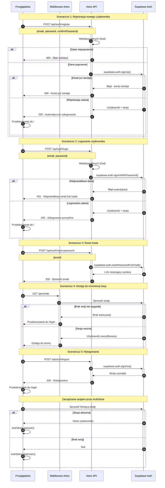

# Diagram Sekwencji Autentykacji - 10xCards

## Analiza Przepływów Autentykacji

Na podstawie analizy specyfikacji z prd.md i auth-spec.md zidentyfikowałem następujące przepływy autentykacji:

### Wszystkie przepływy autentykacji:
- Rejestracja nowego użytkownika (US-001)
- Logowanie istniejącego użytkownika (US-002)
- Odzyskiwanie hasła (US-002B)
- Wylogowanie użytkownika
- Weryfikacja sesji przed dostępem do chronionych zasobów
- Przekierowania dla nieautoryzowanych użytkowników

### Główni aktorzy i ich interakcje:
- **Przeglądarka** - inicjuje żądania użytkownika, wyświetla UI
- **Middleware** - weryfikuje sesje, chroni trasy, przekierowuje
- **Astro API** - endpointy autentykacji, walidacja danych Zod
- **Supabase Auth** - backend autentykacji, zarządzanie sesjami

### Procesy weryfikacji i odświeżania tokenów:
- Sprawdzenie sesji przy ładowaniu aplikacji przez AuthStore
- Middleware weryfikuje JWT tokeny przed dostępem do chronionych tras
- Automatyczne przekierowanie do /login przy braku autoryzacji
- Supabase automatycznie zarządza odświeżaniem tokenów JWT
- Row Level Security (RLS) filtruje dane po user_id

### Opis każdego kroku autentykacji:
- **Rejestracja**: formularz → walidacja → signUp() → automatyczne zalogowanie → redirect
- **Logowanie**: formularz → walidacja → signInWithPassword() → sesja → redirect
- **Reset hasła**: email → resetPasswordForEmail() → link 24h → nowe hasło
- **Wylogowanie**: signOut() → usunięcie sesji → redirect do /login
- **Weryfikacja**: middleware sprawdza sesję → dostęp/przekierowanie

## Diagram Sekwencji Autentykacji

## Kluczowe aspekty bezpieczeństwa

### Weryfikacja i ochrona
1. **Walidacja po stronie serwera** - wszystkie dane są walidowane przez schematy Zod
2. **JWT tokeny** - automatyczne zarządzanie przez Supabase Auth
3. **Middleware** - ochrona tras przed nieautoryzowanym dostępem
4. **RLS (Row Level Security)** - izolacja danych użytkowników w bazie danych

### Zarządzanie sesjami
1. **Automatyczne odświeżanie** tokenów przez Supabase
2. **Synchronizacja stanu** między AuthStore a Supabase Auth
3. **Przekierowania** dla nieautoryzowanych użytkowników
4. **Bezpieczne wylogowanie** z usunięciem wszystkich tokenów

### Obsługa błędów
1. **Spójne komunikaty** błędów bez ujawniania szczegółów technicznych
2. **Graceful handling** błędów sieci i API
3. **Walidacja po stronie klienta** dla lepszego UX
4. **Fallback** mechanizmy przy awariach usług 