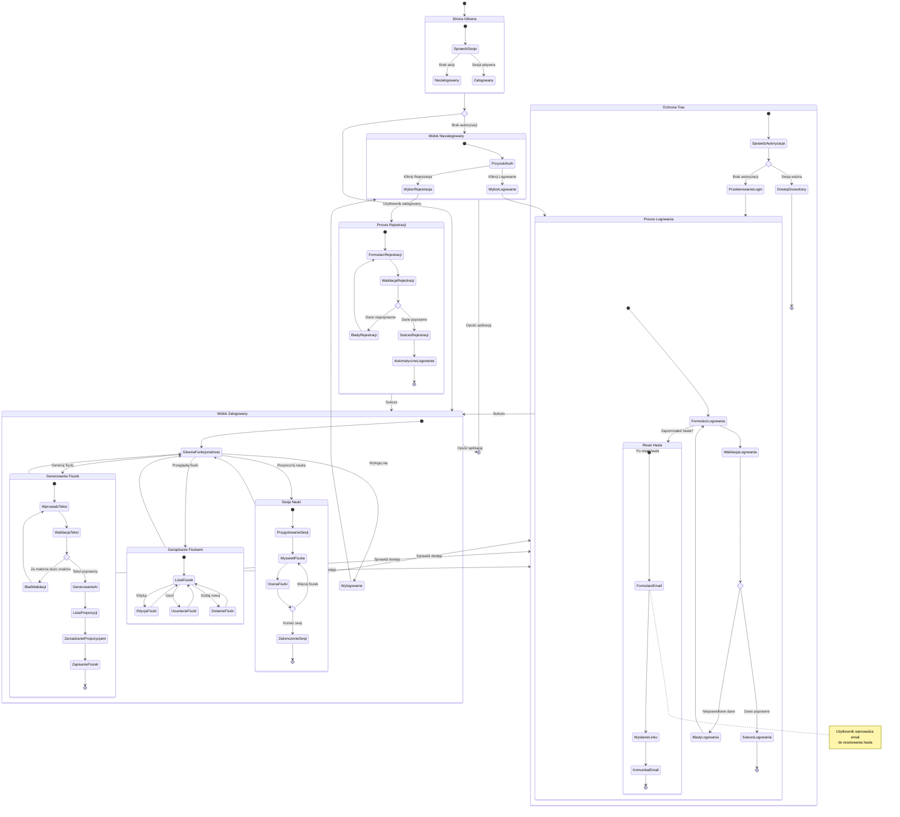

# Diagram Podróży Użytkownika - 10xCards

## Analiza Ścieżek Użytkownika

Na podstawie analizy PRD i specyfikacji autentykacji zidentyfikowałem następujące ścieżki użytkownika:

### Wszystkie ścieżki użytkownika:

- Nowy użytkownik → Rejestracja → Automatyczne zalogowanie → Generowanie fiszek
- Istniejący użytkownik → Logowanie → Dostęp do funkcjonalności
- Użytkownik zapomniał hasła → Reset hasła → Logowanie → Funkcjonalność
- Zalogowany użytkownik → Korzystanie z aplikacji → Wylogowanie
- Nieautoryzowany dostęp → Przekierowanie do logowania

### Główne podróże i odpowiadające stany:

- **Stan początkowy**: Wejście na stronę główną
- **Stan niezalogowanego**: Ograniczony dostęp, widok przycisków auth
- **Proces rejestracji**: Formularz → Walidacja → Sukces
- **Proces logowania**: Formularz → Weryfikacja → Sukces
- **Reset hasła**: Email → Link → Nowe hasło
- **Stan zalogowanego**: Pełny dostęp do funkcjonalności
- **Generowanie fiszek**: Główna funkcjonalność aplikacji

### Punkty decyzyjne i alternatywne ścieżki:

- Czy użytkownik jest zalogowany? → Różne UI i dostępne opcje
- Czy dane rejestracji są poprawne? → Sukces lub błędy walidacji
- Czy dane logowania są prawidłowe? → Dostęp lub komunikat o błędzie
- Czy użytkownik chce się wylogować? → Powrót do stanu niezalogowanego
- Czy próba dostępu do chronionej trasy? → Dostęp lub przekierowanie

### Cel każdego stanu:

- **Strona główna**: Punkt wejścia, prezentacja opcji
- **Rejestracja**: Utworzenie nowego konta
- **Logowanie**: Weryfikacja tożsamości i dostęp
- **Reset hasła**: Odzyskanie dostępu do konta
- **Generowanie fiszek**: Główna wartość aplikacji dla użytkownika
- **Zarządzanie fiszkami**: Organizacja utworzonych materiałów
- **Sesja nauki**: Wykorzystanie fiszek do nauki

## Diagram Podróży Użytkownika

## Kluczowe ścieżki użytkownika

### 🆕 Nowy użytkownik (Happy Path)

1. **Wejście** → Strona główna → Widok niezalogowany
2. **Rejestracja** → Formularz → Walidacja → Automatyczne zalogowanie
3. **Onboarding** → Główna funkcjonalność → Generowanie pierwszych fiszek
4. **Eksploracja** → Przeglądanie fiszek → Pierwsza sesja nauki

### 🔄 Powracający użytkownik

1. **Powrót** → Strona główna → Sprawdzenie sesji
2. **Logowanie** → Formularz → Weryfikacja → Dostęp
3. **Kontynuacja** → Główne funkcjonalności → Zarządzanie fiszkami
4. **Nauka** → Sesje nauki z algorytmem spaced repetition

### 🔐 Reset hasła

1. **Problem z dostępem** → Link "Zapomniałeś hasła?"
2. **Podanie emaila** → Wysłanie linku → Sprawdzenie skrzynki
3. **Nowe hasło** → Powrót do logowania → Normalne korzystanie

### 🛡️ Bezpieczeństwo i ochrona

1. **Nieautoryzowany dostęp** → Middleware → Przekierowanie do logowania
2. **Wygaśnięcie sesji** → Automatyczne wylogowanie → Powrót do logowania
3. **Izolacja danych** → RLS w Supabase → Tylko własne fiszki

## Metryki sukcesu podróży

### Konwersja rejestracji (US-001)

- **Cel**: 75% użytkowników kończy proces rejestracji
- **Punkt miary**: FormularzRejestracji → AutomatyczneLogowanie

### Retencja użytkowników (US-003, US-008)

- **Cel**: 60% użytkowników generuje fiszki w pierwszej sesji
- **Punkt miary**: Pierwsze logowanie → ZapisanieFiszek

### Efektywność AI (Metryki PRD)

- **Cel**: 75% wygenerowanych fiszek zostaje zaakceptowanych
- **Punkt miary**: GenerowanieAI → ZarzadzaniePropozycjami → ZapisanieFiszek

### Wykorzystanie nauki

- **Cel**: 50% użytkowników rozpoczyna sesję nauki w ciągu tygodnia
- **Punkt miary**: MojeFiszki → SesjeNauki
