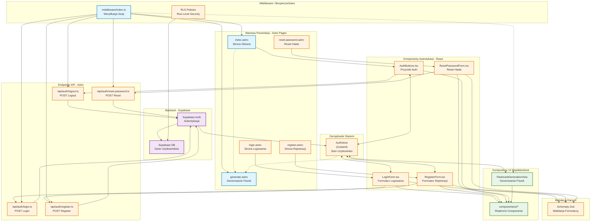

# Diagram Architektury UI - Moduł Autentykacji 10xCards

## Analiza Architektury

Na podstawie analizy specyfikacji modułu logowania i rejestracji z plików referencyjnych oraz przeszukania codebase, zidentyfikowałem następujące komponenty:

### Komponenty wymienione w specyfikacji:

**Strony Astro:**

- `src/pages/index.astro` (częściowo istnieje - wyświetla Welcome component)
- `src/pages/login.astro` (do implementacji)
- `src/pages/register.astro` (do implementacji)
- `src/pages/reset-password.astro` (do implementacji)

**Komponenty React (src/components/auth):**

- `AuthButtons.tsx` (do implementacji)
- `LoginForm.tsx` (do implementacji)
- `RegisterForm.tsx` (do implementacji)
- `ResetPasswordForm.tsx` (do implementacji)

**Endpointy API (src/pages/api/auth):**

- `register.ts` (do implementacji)
- `login.ts` (do implementacji)
- `logout.ts` (do implementacji)
- `reset-password.ts` (do implementacji)

**Store i middleware:**

- `AuthStore` (Zustand) (do implementacji)
- `src/middleware/index.ts` (istnieje, ale wymaga rozszerzenia o autoryzację)

**Istniejące komponenty:**

- Podstawowy klient Supabase (`src/db/supabase.client.ts`)
- Komponenty UI z Shadcn/ui (`src/components/ui/`)
- Komponenty dla generowania fiszek

### Przepływ danych między komponentami:

- AuthButtons → formularze logowania/rejestracji
- Formularze → endpointy API → Supabase Auth
- AuthStore ↔ komponenty (zarządzanie stanem użytkownika)
- Middleware → weryfikacja sesji → przekierowania

### Funkcjonalność każdego komponentu:

- **AuthButtons**: Wyświetlanie odpowiednich przycisków w zależności od stanu autoryzacji
- **LoginForm/RegisterForm**: Walidacja i przesyłanie danych autentykacji
- **ResetPasswordForm**: Resetowanie hasła przez email
- **Endpointy API**: Komunikacja z Supabase Auth
- **AuthStore**: Globalny stan użytkownika
- **Middleware**: Ochrona tras i weryfikacja sesji

## Diagram Architektury UI

## Legenda

**Kolorowanie komponentów:**

- 🟦 **Niebieskie** - komponenty już zaimplementowane w projekcie
- 🟠 **Pomarańczowe** - komponenty do implementacji zgodnie ze specyfikacją auth-spec.md
- 🟣 **Fioletowe** - backend (Supabase Auth i Database)
- 🟢 **Zielone** - komponenty współdzielone (UI components, istniejące funkcjonalności)

**Kluczowe przepływy:**

1. **Autentykacja**: Strony → Komponenty React → API Endpoints → Supabase Auth
2. **Stan globalny**: AuthStore (Zustand) synchronizowany z wszystkimi komponentami autentykacji
3. **Ochrona tras**: Middleware weryfikuje sesje przed dostępem do chronionych zasobów
4. **Bezpieczeństwo**: Row Level Security (RLS) w Supabase zapewnia izolację danych użytkowników

**Wymagane aktualizacje:**

- Strona główna (`index.astro`) wymaga integracji z AuthButtons dla wyświetlania odpowiednich opcji
- Middleware wymaga rozszerzenia o logikę autoryzacji i przekierowań
- Wszystkie chronione komponenty (np. generowanie fiszek) wymagają integracji z AuthStore
